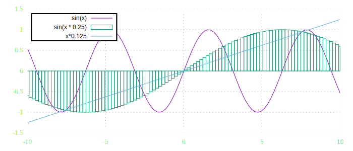
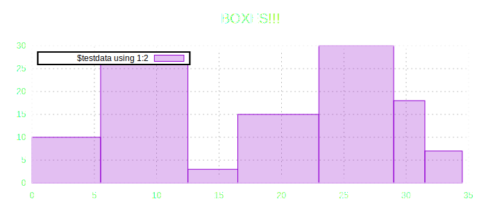
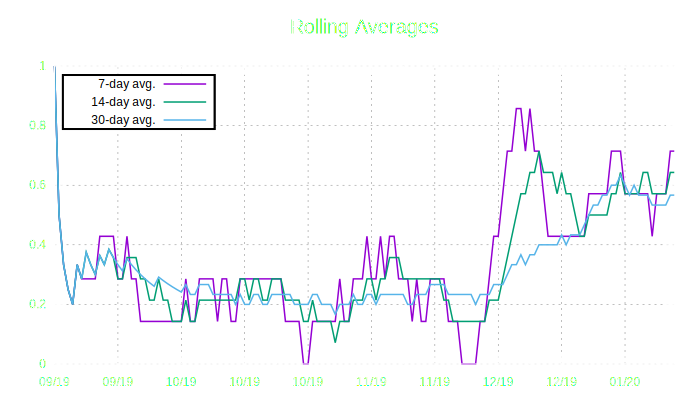

# Introduction

Originally developed for my Emacs setup "Ryscomacs", rysco-plot is a domain specific language in Lisp for the gnuplot syntax and tools.

# Installation

## Using straight.el

    (straight-use-package '(rysco-graph :type git :repo "git@bitbucket.org:scott105/rysco-graph.git"))

# Syntax and Examples

The syntax is somewhat permissive in how it is represented, with general rules applied to convert the mostly free-usage of `:` as a prefix for any argument and vectors/lists to appropriate forms for gnuplot.

## :plot

    (rysco-plot
     '(
       (:set :key fixed left top vertical Right noreverse enhanced autotitle box lt black linewidth 2.000 dashtype solid opaque)
       (:set :grid)
       (:set :border lc "white")
       (:set :title font ",20" textcolor lt -1 norotate tc "white")
    
       (:plot [-10 10]
              (:lines :fun (sin x))
              (:boxes :fun (sin x * 0.25))
              (:lines :fun (* x 0.125))))
     :dimensions '(700 300))

## :data

Data is provided to gnuplot by embedding directly into the file. Note that this may not be sufficient for large datasets.

This example uses the following table as input into a `:data` entry and uses that for plotting some boxes.

<table id="orgf407d3e" border="2" cellspacing="0" cellpadding="6" rules="groups" frame="hsides">

<colgroup>
<col  class="org-right" />

<col  class="org-right" />
</colgroup>
<thead>
<tr>
<th scope="col" class="org-right">x</th>
<th scope="col" class="org-right">y</th>
</tr>
</thead>

<tbody>
<tr>
<td class="org-right">1</td>
<td class="org-right">10</td>
</tr>

<tr>
<td class="org-right">10</td>
<td class="org-right">28</td>
</tr>

<tr>
<td class="org-right">15</td>
<td class="org-right">3</td>
</tr>

<tr>
<td class="org-right">18</td>
<td class="org-right">15</td>
</tr>

<tr>
<td class="org-right">28</td>
<td class="org-right">30</td>
</tr>

<tr>
<td class="org-right">30</td>
<td class="org-right">18</td>
</tr>

<tr>
<td class="org-right">33</td>
<td class="org-right">7</td>
</tr>
</tbody>
</table>

    (rysco-plot
     `(
       (:set :key fixed left top vertical Right noreverse enhanced autotitle box lt black linewidth 2.000 dashtype solid opaque)
       (:set :grid)
       (:set :border lc "white")
       (:set :title font ",20" textcolor lt -1 norotate tc "white")
    
       (:data testdata ,@in)
       (:set :yrange [0 *])
    
       (:set :title "BOXES!!!")
       (:set :style fill solid 0.25 border)
    
       (:plot [* *]
              (:boxes :data testdata :using [1 2]))
       )
     :dimensions '(700 300))

### :plot-date-log

A convenience for when working with dated logs of where there is a row per date.
That data can be supplied as values or an entry can be treated as boolean.

<table id="orgc12e1a9" border="2" cellspacing="0" cellpadding="6" rules="groups" frame="hsides">

<colgroup>
<col  class="org-right" />

<col  class="org-left" />
</colgroup>
<thead>
<tr>
<th scope="col" class="org-right">Date</th>
<th scope="col" class="org-left">Note</th>
</tr>
</thead>

<tbody>
<tr>
<td class="org-right">2019-09-05</td>
<td class="org-left">&#xa0;</td>
</tr>

<tr>
<td class="org-right">2019-09-10</td>
<td class="org-left">&#xa0;</td>
</tr>

<tr>
<td class="org-right">2019-09-12</td>
<td class="org-left">&#xa0;</td>
</tr>

<tr>
<td class="org-right">2019-09-15</td>
<td class="org-left">&#xa0;</td>
</tr>

<tr>
<td class="org-right">2019-09-17</td>
<td class="org-left">&#xa0;</td>
</tr>

<tr>
<td class="org-right">2019-09-21</td>
<td class="org-left">&#xa0;</td>
</tr>

<tr>
<td class="org-right">2019-09-28</td>
<td class="org-left">&#xa0;</td>
</tr>

<tr>
<td class="org-right">2019-10-04</td>
<td class="org-left">&#xa0;</td>
</tr>

<tr>
<td class="org-right">2019-10-07</td>
<td class="org-left">&#xa0;</td>
</tr>

<tr>
<td class="org-right">2019-10-12</td>
<td class="org-left">&#xa0;</td>
</tr>

<tr>
<td class="org-right">2019-10-16</td>
<td class="org-left">&#xa0;</td>
</tr>

<tr>
<td class="org-right">2019-10-19</td>
<td class="org-left">&#xa0;</td>
</tr>

<tr>
<td class="org-right">2019-10-23</td>
<td class="org-left">&#xa0;</td>
</tr>

<tr>
<td class="org-right">2019-11-01</td>
<td class="org-left">&#xa0;</td>
</tr>

<tr>
<td class="org-right">2019-11-07</td>
<td class="org-left">&#xa0;</td>
</tr>

<tr>
<td class="org-right">2019-11-10</td>
<td class="org-left">&#xa0;</td>
</tr>

<tr>
<td class="org-right">2019-11-13</td>
<td class="org-left">&#xa0;</td>
</tr>

<tr>
<td class="org-right">2019-11-16</td>
<td class="org-left">&#xa0;</td>
</tr>

<tr>
<td class="org-right">2019-11-18</td>
<td class="org-left">&#xa0;</td>
</tr>

<tr>
<td class="org-right">2019-11-24</td>
<td class="org-left">&#xa0;</td>
</tr>

<tr>
<td class="org-right">2019-11-27</td>
<td class="org-left">&#xa0;</td>
</tr>

<tr>
<td class="org-right">2019-12-08</td>
<td class="org-left">&#xa0;</td>
</tr>

<tr>
<td class="org-right">2019-12-10</td>
<td class="org-left">&#xa0;</td>
</tr>

<tr>
<td class="org-right">2019-12-11</td>
<td class="org-left">&#xa0;</td>
</tr>

<tr>
<td class="org-right">2019-12-13</td>
<td class="org-left">&#xa0;</td>
</tr>

<tr>
<td class="org-right">2019-12-14</td>
<td class="org-left">&#xa0;</td>
</tr>

<tr>
<td class="org-right">2019-12-15</td>
<td class="org-left">&#xa0;</td>
</tr>

<tr>
<td class="org-right">2019-12-16</td>
<td class="org-left">&#xa0;</td>
</tr>

<tr>
<td class="org-right">2019-12-17</td>
<td class="org-left">&#xa0;</td>
</tr>

<tr>
<td class="org-right">2019-12-19</td>
<td class="org-left">&#xa0;</td>
</tr>

<tr>
<td class="org-right">2019-12-21</td>
<td class="org-left">&#xa0;</td>
</tr>

<tr>
<td class="org-right">2019-12-24</td>
<td class="org-left">&#xa0;</td>
</tr>

<tr>
<td class="org-right">2019-12-26</td>
<td class="org-left">&#xa0;</td>
</tr>

<tr>
<td class="org-right">2019-12-28</td>
<td class="org-left">&#xa0;</td>
</tr>

<tr>
<td class="org-right">2019-12-31</td>
<td class="org-left">&#xa0;</td>
</tr>

<tr>
<td class="org-right">2020-01-01</td>
<td class="org-left">&#xa0;</td>
</tr>

<tr>
<td class="org-right">2020-01-02</td>
<td class="org-left">&#xa0;</td>
</tr>

<tr>
<td class="org-right">2020-01-04</td>
<td class="org-left">&#xa0;</td>
</tr>

<tr>
<td class="org-right">2020-01-06</td>
<td class="org-left">&#xa0;</td>
</tr>

<tr>
<td class="org-right">2020-01-07</td>
<td class="org-left">&#xa0;</td>
</tr>

<tr>
<td class="org-right">2020-01-08</td>
<td class="org-left">&#xa0;</td>
</tr>

<tr>
<td class="org-right">2020-01-11</td>
<td class="org-left">&#xa0;</td>
</tr>

<tr>
<td class="org-right">2020-01-13</td>
<td class="org-left">&#xa0;</td>
</tr>

<tr>
<td class="org-right">2020-01-14</td>
<td class="org-left">&#xa0;</td>
</tr>

<tr>
<td class="org-right">2020-01-16</td>
<td class="org-left">&#xa0;</td>
</tr>

<tr>
<td class="org-right">2020-01-18</td>
<td class="org-left">&#xa0;</td>
</tr>

<tr>
<td class="org-right">2020-01-19</td>
<td class="org-left">&#xa0;</td>
</tr>

<tr>
<td class="org-right">2020-01-20</td>
<td class="org-left">&#xa0;</td>
</tr>
</tbody>
</table>

    (rysco-plot
     `(
       ,@(cl-loop
          for id in '(1 2 3 4) collect
          `(:set :linetype ,id :linewidth 1.5))
    
       (:set :key fixed left top vertical Right noreverse enhanced autotitle box lt black linewidth 2.000 dashtype solid opaque)
       (:set :grid)
       (:set :border lc "white")
       (:set :title font ",20" textcolor lt -1 norotate tc "white")
    
    
       ;; (:set :multiplot :layout (2 1))
    
       (:data datelogdata ,@(rysco-org-process-date-log in '(7 14 30)))
       (:plot-date-log :title "Rolling Averages"
                       :data datelogdata :end "2020-01-20"
                       :col 3
                       :map ("7-day avg." "14-day avg." "30-day avg."))
    
       ) :dimensions '(700 400))

*Note: `rysco-org-process-date-log` is not included*
*It generates a table with rolling averages for specified intervals, one per column*

